# Soccer Analytics Engineering ⚽️

Welcome to the **Soccer Analytics Engineering** repository. This project focuses on building a high-performance, normalized analytical database from [StatsBomb Open Data](https://github.com/statsbomb/open-data) using DuckDB.

---

## 🚀 Overview

This repository provides a robust ETL pipeline that transforms raw StatsBomb JSON files into a structured, queryable **DuckDB** database. It is designed for high-performance tactical analysis, including advanced metrics like Expected Threat (xT) and spatial mapping.

### Key Features
- **High Performance**: Leverages DuckDB's columnar storage for lightning-fast queries with optimized single-pass ETL (3-4x faster builds).
- **Normalized Schema**: 15 core tables with full referential integrity, ENUM types for categorical data, and composite indexes.
- **Data Enrichment**: Integrated player canonicalization, 360 tracking data support, and dynamic lineup tracking.
- **Comprehensive Testing**: Validated with a suite of ~100 data integrity and quality tests.
- **Optimized Storage**: Removed redundant JSON columns, using extracted coordinate columns for better performance.

---

## 🏗 System Architecture

The following diagram illustrates the data flow from raw StatsBomb JSONs to the final analytical database.

```mermaid
graph TD
    subgraph "Data Sources 📁"
        SB[StatsBomb Open Data]
        COMP[competitions.json]
        MATCH[matches/*.json]
        EVENT[events/*.json]
        LINEUP[lineups/*.json]
        THREE60[three-sixty/*.json]
    end

    subgraph "ETL Pipeline ⚙️"
        BUILD[build.py]
        SCHEMA[schema/ package]
    end

    subgraph "Storage 💾"
        DB[(stats.duckdb)]
    end

    subgraph "Verification 🛡️"
        TESTS[pytest suite]
    end

    SB --> COMP
    SB --> MATCH
    SB --> EVENT
    
    COMP --> BUILD
    MATCH --> BUILD
    EVENT --> BUILD
    LINEUP --> BUILD
    THREE60 --> BUILD
    
    SCHEMA --> BUILD
    BUILD --> DB
    DB --> TESTS
```



---

## 🛠 Setup & Installation

Follow these steps to initialize your environment and build the database.

### 1. Prerequisites
- **Python 3.12+**
- **Git**

### 2. Environment Setup
```bash
# Initialize and activate virtual environment
python3 -m venv venv
source venv/bin/activate  # macOS/Linux
# venv\Scripts\activate  # Windows

# Install dependencies
pip install -r requirements.txt
```

### 3. Data Acquisition
```bash
# Clone the StatsBomb open-data repository (this takes a few minutes)
git clone --depth 1 https://github.com/statsbomb/open-data.git
```

### 4. Build the Database
```bash
# Run the build script
python3 build.py
```
This will generate `stats.duckdb` in the root directory.

---

## 🔍 Database Usage

Once built, you can query the database directly using any DuckDB client or Python.

### Example SQL Queries

#### Top Goal Scorers
```sql
SELECT 
    player, 
    team, 
    COUNT(*) as goals 
FROM events 
WHERE shot_outcome = 'Goal' 
GROUP BY 1, 2 
ORDER BY 3 DESC 
LIMIT 10;
```

#### Pass Completion Rate by Team
```sql
SELECT
    team,
    COUNT(*) as total_passes,
    ROUND(SUM(CASE WHEN pass_outcome IS NULL THEN 1 ELSE 0 END) * 100.0 / COUNT(*), 2) as completion_pct
FROM events
WHERE type = 'Pass'
GROUP BY 1
ORDER BY 3 DESC;
```

#### Advanced 360 Tracking Analysis
Find player positions during a specific shot:
```sql
SELECT 
    e.player, 
    e.type, 
    p.location_x, 
    p.location_y, 
    p.teammate
FROM events e
JOIN three_sixty_positions p ON e.id = p.event_uuid
WHERE e.type = 'Shot' AND e.match_id = 3788741;
```

---

## 📚 Documentation

For deep dives into the engineering and data structure, refer to the following:

- 📑 **[db_spec.md](docs/db_spec.md)**: Detailed schema, table definitions, and indexing strategy.
- 🧪 **[tests.md](docs/tests.md)**: Overview of the testing suite and data quality checks.

---

## ✅ Testing & Quality Assurance

The repository includes a comprehensive test suite to ensure data integrity.

```bash
# Run all tests
pytest -v
```

The tests cover:
- **Schema Validation**: Correctness of tables and types.
- **Referential Integrity**: PK/FK consistency across all 15 tables.
- **Data Quality**: Coordinate bounds, xG ranges, and event sequences.

## 🙏 Acknowledgments
This repository was built off of the work done by the [NYU MSDS Fall 2025 Soccer capstone team](https://github.com/TrilemmaFoundation/NYU-MSDS-F25-Soccer).

---

## 📜 License

This project is licensed under the **MIT License**.
*Note: Usage of StatsBomb Open Data is subject to their [CC BY-NC 4.0](https://creativecommons.org/licenses/by-nc/4.0/) license (non-commercial use only).*
